# Getting started with mqtt-smarthome - Homematic, Node-RED and Node-RED-Dashboard


I created and tested this Howto using a minimal Debian Jessie (8.7) 64Bit VM, but it should be also applicable for e.g. [Armbian](https://www.armbian.com/), Ubuntu and other Debian based Linux Distributions.  

To follow this Howto you should have basic Linux system administration knowledge. Also you should already know how the mqtt-smarthome concept works, I suggest you read through the [talks](https://github.com/mqtt-smarthome/mqtt-smarthome/tree/master/talks) and [architecture overview](https://github.com/mqtt-smarthome/mqtt-smarthome/blob/master/Architecture.md) if you have not done so yet.

If you have questions or experience problems with this Howto please create an [Issue](https://github.com/mqtt-smarthome/mqtt-smarthome/issues/new). English and German are ok.

## Contents

* [Software Installation](#software-installation)
* [Configure PM2](#configure-pm2)
* [Use MQTT-Admin](#use-mqtt-admin)
* [Node-RED flow example](#node-red-flow-example)
* [Node-RED-Dashboard example](#node-red-dashboard-example)
* [Where to go from here?](#where-to-go-from-here)
* [Changelog](#changelog)

## Software Installation

### Mosquitto

```
wget http://repo.mosquitto.org/debian/mosquitto-repo.gpg.key
sudo apt-key add mosquitto-repo.gpg.key
cd /etc/apt/sources.list.d/
sudo wget http://repo.mosquitto.org/debian/mosquitto-jessie.list
cd
sudo apt-get update
sudo apt-get install mosquitto mosquitto-clients
```

#### Configuration

Edit Mosquittos config file to allow connections via websocket on Port 8080. This is needed to enable Browser based apps to connect to the Broker, we come back to this later.

Use your favorite editor and add the following 4 Lines to the file `/etc/mosquitto/mosquitto.conf`:

```
listener 1883 0.0.0.0
protocol mqtt

listener 8080 0.0.0.0
protocol websockets
```

Restart Mosquitto afterwards: `sudo systemctl restart mosquitto`


### Node.js

I suggest to use [n](https://github.com/tj/n) to install [Node.js](https://nodejs.org). This will make it comfortable to update Node.js or even use different Versions in parallel. We will need git and make for this installation.

```
sudo apt-get install git make
git clone https://github.com/tj/n
cd n
sudo make install
sudo n stable
```

### pm2
[pm2](http://pm2.keymetrics.io/) is a process manager. We use it to start the needed software on system boot and manage log files.

`sudo npm install -g pm2`

### hm2mqtt.js
This is a little piece of Software that interfaces your Homematic CCU to the MQTT Broker.

`sudo npm install -g hm2mqtt`

### Node-RED
[Node-RED](https://nodered.org) is an awesome software giving you the possibility to connect things and implement automation rules with a graphical user interface.

```
sudo npm install -g node-red
sudo npm install -g node-red-dashboard
```

### Create a user
I suggest to create an user under which all your mqtt-smarthome related software will run.

```
sudo adduser smarthome --shell /bin/bash
sudo usermod -aG sudo smarthome
```

Now log out and re-login with the newly create user smarthome.


## Configure pm2

First we let pm2 install itself as a service that starts up automatically on system boot. Then we tell pm2 which software it should start for us. Replace the IP Address of your CCU in this example. The save command at the end persists the pm2 settings.

```
sudo -E pm2 startup -u smarthome
pm2 start node-red
pm2 start hm2mqtt -- --ccu-address 192.168.1.100
pm2 save
```

If you call `pm2 list` you should see an output like this:

```
│ hm2mqtt  │ 0  │ fork │ 3605 │ online │ 0       │ 11s    │ 0%  │ 90.9
│ node-red │ 0  │ fork │ 3573 │ online │ 0       │ 39s    │ 0%  │ 77.1 
```

Now the software setup is done.

### Check logfiles

To check if everything is alright with hm2mqtt and node-red you can use pm2 to show their logfiles, e.g. `pm2 logs hm2mqtt`. See `pm2 help` for more options.


## Use mqtt-admin 

You can use the tool [mqtt-admin](https://github.com/hobbyquaker/mqtt-admin) to see what's going on on your MQTT broker. This Tools doesn't need to be installed, you can just open [https://hobbyquaker.github.io/mqtt-admin](https://hobbyquaker.github.io/mqtt-admin) in your browser and connect to your broker. In the connect screen enter the IP address of the host running Mosquitto and `8080` as port, then click `Save Settings`. When the conenction dialog disappears you're connected to Mosquitto. Then change to the Tab 'Status' and enter `hm/#` in the top-most input field. You should see a list of MQTT topics on which messages were already published by hm2mqtt. You could now filter out a specific Homematic sensor or actuator, do something with it (e.g. switch a light on) and see what happens. 

Here an example Screenshot for my basement light:
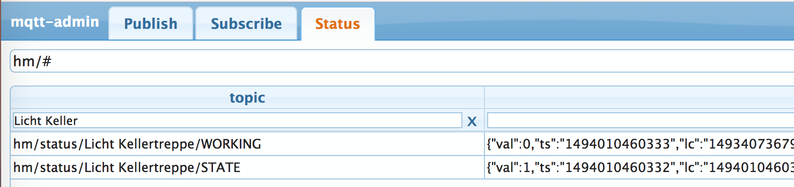
when I switch that light on and off I can see the `val` attribute changing on the topic `hm/status/Licht Kellertreppe/STATE`

You can now also switch that light on and off via MQTT, use the tab 'Publish' for that and try out different payloads (0 to turn off, 1 to turn on)

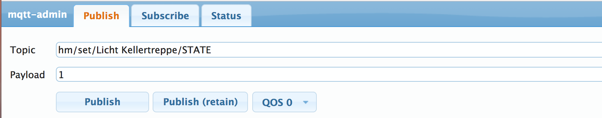

Notice that we don't publish on the same topic the status is published by hm2mqtt. Instead of hm/_status_/... we use hm/**set**/... to switch the light on and off.


## Node-RED flow example

#### Add an MQTT input node

Node-RED is reachable via http on port 1880, so open `http://<ip-address>:8080/` in your browser. In this simple example I will create a flow that switches my basement light off 5 minutes after it was switched on. For this we will need at first an _mqtt input_ node. Just drag it from the left to the right. Doubleclick it to open its configuration dialog. Click on the small pencil next to 'Add a new mqtt-broker'. In the dialog that opens then just enter `127.0.0.1` as Server and click on 'Add' then. Back in the nodes configuration we have to enter a topic, I use my basement light as example again:

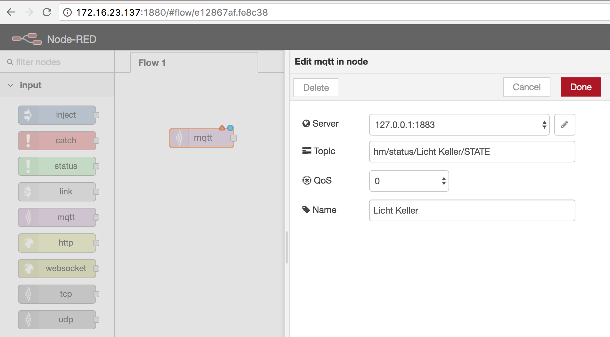

#### Process the incoming message

Because mqtt-smarthome conform software publishes a JSON payload with the actual value in the `val` attribute we need some processing to get the actual state of the light. For this we use a _function node_, in this node it's possible to use javascript:

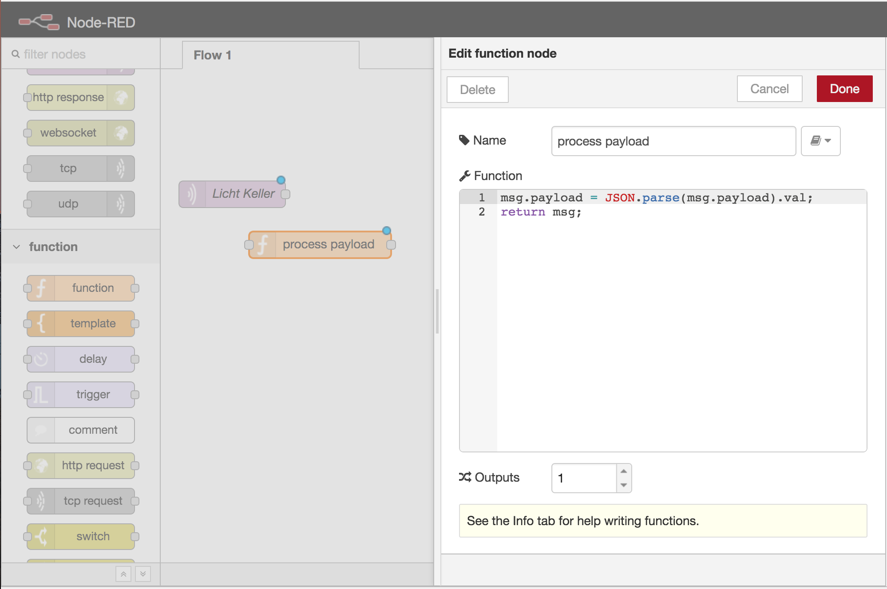

This node will now output just a the content of the attribute `val`, we can now add a _switch node_ that gives us two different outputs, one emits a message if the val is 1, the other if the val is 0. 

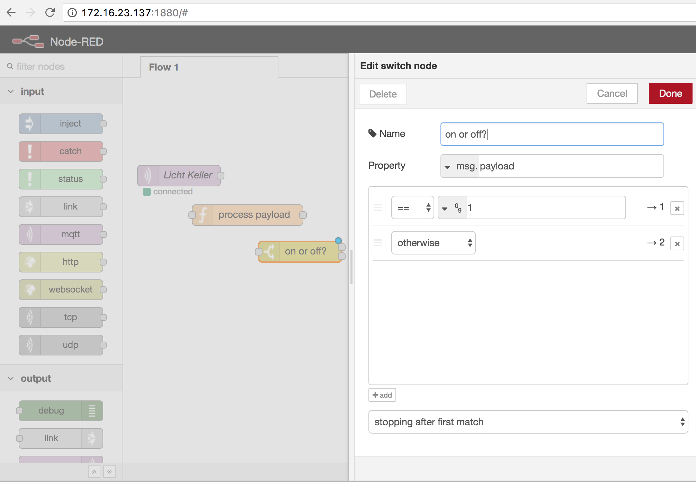

#### Wait 5 minutes 

Now we add a _delay node_ that delays message forwarding for 5 minutes.

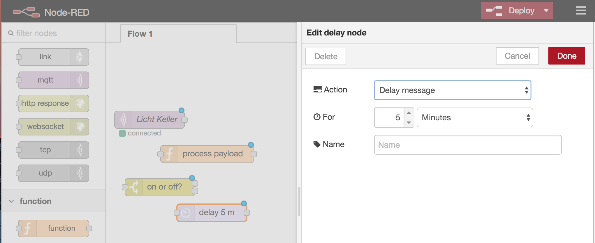

#### Send message to switch lamp off

Another function node that sets the messages payload to `0` (as we want to switch the lamp off)

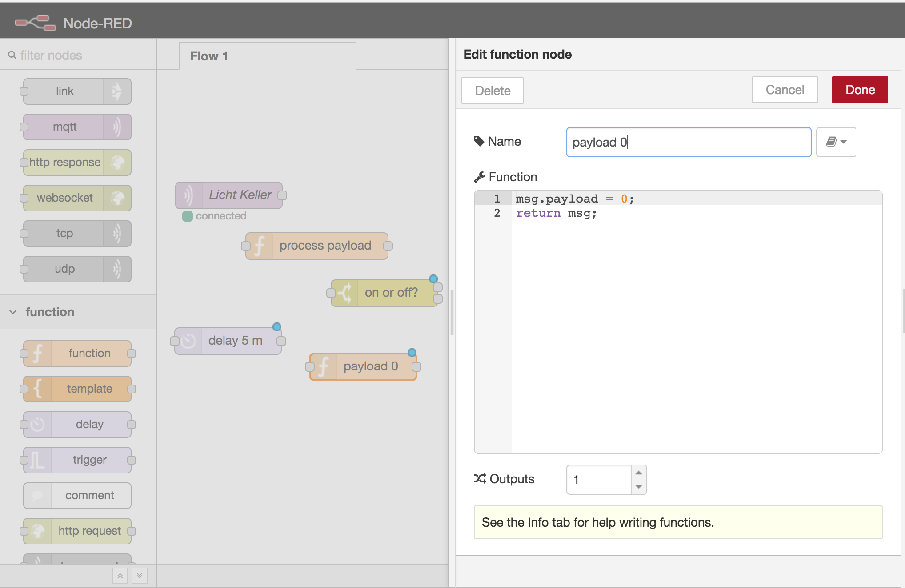

... and an _mqtt output_ to send the command to hm2mqtt. Again take care to use the correct topic, again we need hm/**set**/... here.

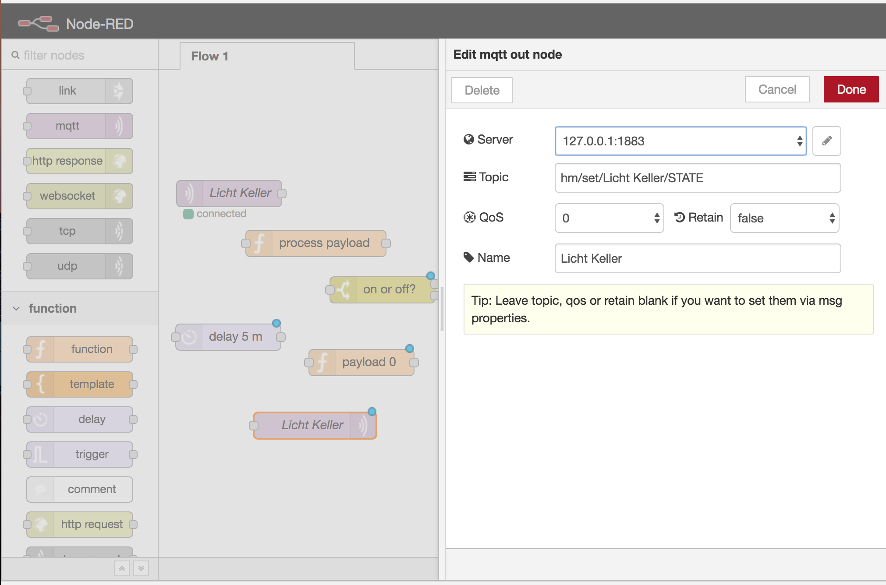

#### Wire and start the flow

The final step is then to wire all the nodes together and press the red 'Deploy' button on the top right to activate the flow.

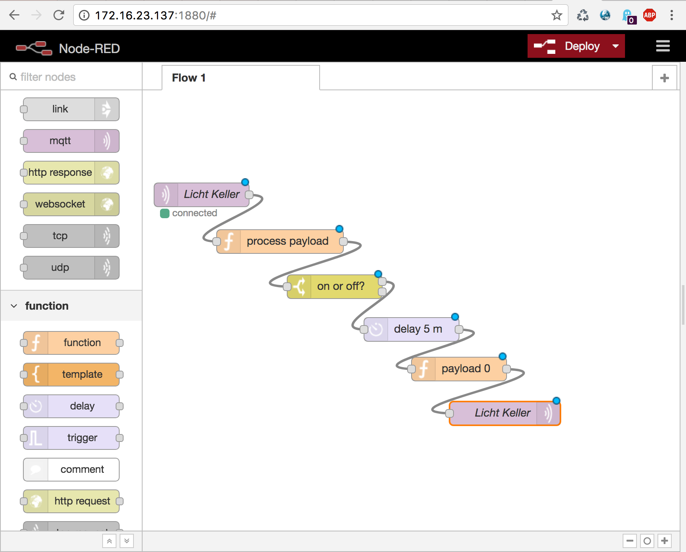

Now you can test your first flow by switching on the light and wait for 5 minutes. Or you just reduce the time in the _delay node_ if you're in a hurry ;-)

Please notice that this flow isn't meant as a real smart home rule, it's just an example to show you the principles. It could be done better, it could be done with less nodes, now it's up on you to find out how to use Node-RED :-)

## Node-RED-Dashboard example

Node-RED-Dashboard is an awesome tool to easily create an user interface that can be used in any browser and on your mobile devices. Following example will just show you how create a website with a switch for the basement light. We can reuse some nodes from our first flow example here, you can just copy the _mqtt input node_, the _mqtt output node_ and the 'process payload' _function node_. In between the 'process payload' and the mqtt output node we insert a _Dashboard switch node_. Please mind that you have to remove the `if msg arrives on input, pass through to output` checkmark.

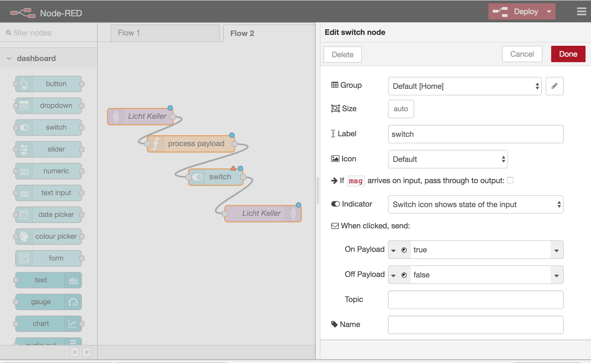

After deploying this new flow point your browser on `http://<ip-address:1880/ui` and you will see this result:

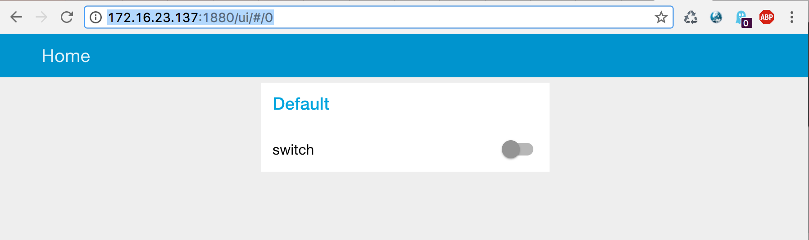

Now we have a user interface for the lamp in the basement and we can switch it on and off. Again - this is just a very simple example, with Node-RED-Dashboard you have many many more possibilities - have fun! ;-)


## Where to go from here?

You now opened up two "worlds" at once:

* You can go further with mqtt-smarthome and attach more things directly to your MQTT broker. There are a lot of mqtt interfaces for all kinds of soft- and hardware and different smart home systems. See [this list of software that "speaks" MQTT](https://github.com/hobbyquaker/awesome-mqtt/#interfaces)...
* You can extend Node-RED with additional Nodes. Just take look at the [Node-RED library](https://flows.nodered.org), you will find thousands of flows and nodes...


## Changelog

* Howto version 1, 5'2017, Sebastian Raff <hq@ccu.io>


_In memoriam of Oli Wagner, the founder/initatior of the mqtt-smarthome project._

